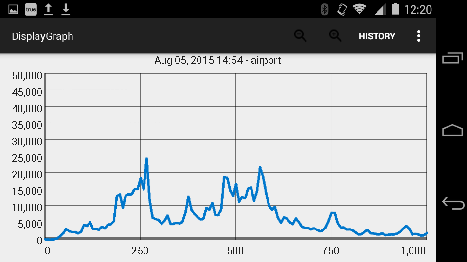
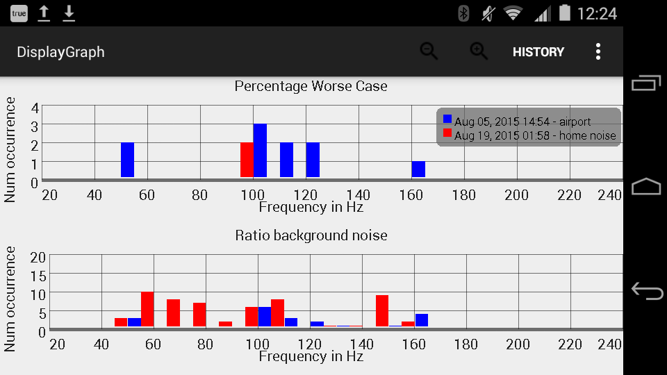

# Hum-App
<h3>Android application to capture, store and record low frequency noise</h3>
<h4>Developed during Mitacs Globalink internship at University of Calgary, 2015.</h4>

The Ranchlands' Hum is a low frequency urban noise nuisance that has been plaguing the residents of Calgary, Canada for years. Its source is yet undetected. This 
application was developed during a 3 month internship in University of Calgary to capture, store and analyze low frequency audio resembling the Ranchlands' Hum. 

Its features include:

<ul>
<li> Ability to capture 10 seconds of noise in bursts, and plot its frequency spectrum by using the FFT algorithm. </li> 
<li> Calculate performance metrics to determine strongest frequencies (high SNR - <i>Percentage Worse Case Frequencies</i>) and frequencies overshadowed by background noise (low SNR - <i>Ratio Background Noise Frequencies</i>) and plot their histogram.</li>
<li>Store all the relevant information in an SQLite database and integrate it with the UI so that any recording from any time can be accessed and compared with other recordings, if desired.</li>
<li>The graphs and histograms are plotted with the GraphView library.</li>
</ul>
<h3 align = "center"> App Screenshots </h3>

  <h6 align = "center">Frequency Spectrum of noise recorded at airport</h6>

  <h6 align = "center">Comparison of airport noise with home noise</h6>

